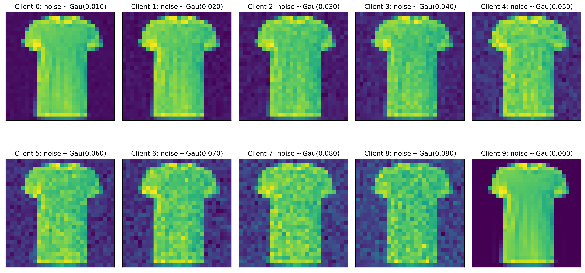
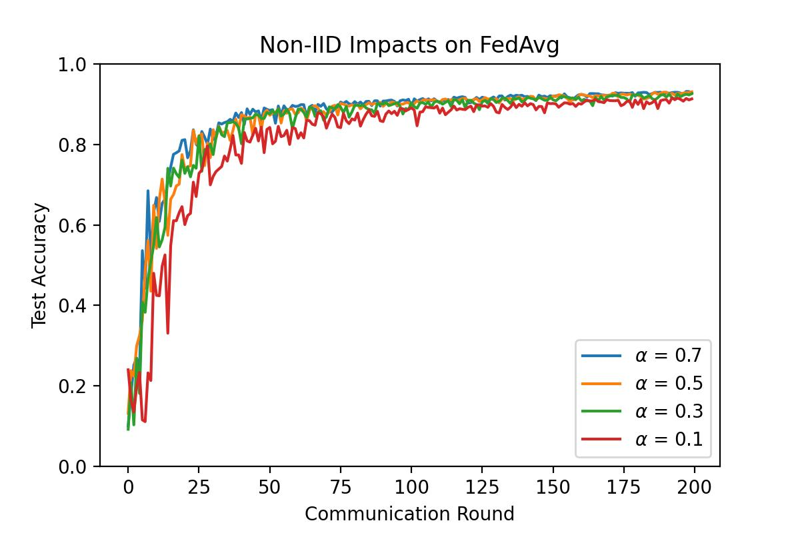

<p align="center"></p>

# FedLab: A Flexible Federated Learning Framework

[](https://github.com/SMILELab-FL/FedLab/actions) [](https://fedlab.readthedocs.io/en/master/?badge=master) [](https://opensource.org/licenses/Apache-2.0) [](https://codecov.io/gh/SMILELab-FL/FedLab) [](https://arxiv.org/abs/2107.11621) [](https://pypi.python.org/pypi/fedlab)


Federated learning (FL), proposed by Google at the very beginning, is recently a burgeoning research area of machine learning, which aims to protect individual data privacy in the distributed machine learning processes, especially in finance, smart healthcare, and edge computing. Different from traditional data-centered distributed machine learning, participants in the FL setting utilize localized data to train local models, then leverages specific strategies with other participants to acquire the final model collaboratively, avoiding direct data-sharing behavior.

To relieve the burden of researchers in implementing FL algorithms and emancipate FL scientists from the repetitive implementation of basic FL settings, we introduce a highly customizable framework __FedLab__ in this work. __FedLab__ provides the necessary modules for FL simulation, including ***communication***, ***compression***, ***model optimization***, ***data partition*** and other ***functional modules***. Users can build an FL simulation environment with custom modules like playing with LEGO bricks. For better understanding and easy usage, the FL baseline algorithms implemented via __FedLab__ are also presented.


## Quick start

### Install

- Install the latest version from source code:
```
$ git clone git@github.com:SMILELab-FL/FedLab.git
$ cd FedLab
$ pip install -r requirements.txt
```

- Install the stable version (old version) via pip:
```
# assign the version fedlab==1.1.2
$ pip install fedlab 
```

### Learning materials

We provide tutorials in jupyter notebook format for FedLab beginners in FedLab\tutorials. These tutorials include data partition, customized algorithms, and pipeline demos. For the FedLab or FL beginners, we recommend this [notebook](tutorials/pipeline_tutorial.ipynb). Furthermore, we provide reproductions of federated algorithms via FedLab, which are stored in fedlab.contirb.algorithm. We think they are good examples for users to further explore FedLab.

[Website Documentations](https://fedlab.readthedocs.io/en/master/) are availiable:

- [Overview of FedLab](https://fedlab.readthedocs.io/en/master/overview.html)
- [Installation & Setup](https://fedlab.readthedocs.io/en/master/install.html)
- [Examples](https://fedlab.readthedocs.io/en/master/example.html)
- [Contribute Guideline](https://fedlab.readthedocs.io/en/master/contributing.html)
- [API Reference](https://fedlab.readthedocs.io/en/master/autoapi/index.html)


### Run Examples

- Run our quick start examples of different scenarios with a partitioned MNIST dataset.

```
# example of standalone
$ cd ./examples/standalone/
$ python standalone.py --total_client 100 --com_round 3 --sample_ratio 0.1 --batch_size 100 --epochs 5 --lr 0.02
```

## Architecture
Files architecture of FedLab. These contents may be helpful for users to understand our repo.

```
├── fedlab
│   ├── contrib
│   ├── core
│   ├── models
│   └── utils
├── datasets
│   └── ...
├── examples
│   ├── asynchronous-cross-process-mnist
│   ├── cross-process-mnist
│   ├── hierarchical-hybrid-mnist
│   ├── network-connection-checker
│   ├── scale-mnist
│   └── standalone-mnist
└── tutorials
    ├── communication_tutorial.ipynb
    ├── customize_tutorial.ipynb
    ├── pipeline_tutorial.ipynb
    └── ...
```

## Baselines

We provide the reproduction of baseline federated algorthms for users in this repo.

| Method              | Type   | Paper                                                        | Publication  | Official code                                        |
| ------------------- | ------ | ------------------------------------------------------------ | ------------ | ---------------------------------------------------- |
| FedAvg              | Optim. | [Communication-Efficient Learning of Deep Networks from Decentralized Data](http://proceedings.mlr.press/v54/mcmahan17a/mcmahan17a.pdf) | AISTATS'2017 |                                                      |
| FedProx             | Optim. | [Federated Optimization in Heterogeneous Networks](https://arxiv.org/abs/1812.06127) | MLSys' 2020  | [Code](https://github.com/litian96/FedProx)          |
| FedDyn              | Optim. | [Federated Learning Based on Dynamic Regularization](https://openreview.net/forum?id=B7v4QMR6Z9w) | ICLR' 2021   | [Code](https://github.com/alpemreacar/FedDyn)        |
| q-FFL               | Optim. | [Fair Resource Allocation in Federated Learning](https://arxiv.org/abs/1905.10497) | ICLR' 2020   | [Code](https://github.com/litian96/fair_flearn)      |
| FedNova             | Optim. | [Tackling the Objective Inconsistency Problem in Heterogeneous Federated Optimization](https://proceedings.neurips.cc/paper/2020/hash/564127c03caab942e503ee6f810f54fd-Abstract.html) | NeurIPS'2020 | [Code](https://github.com/JYWa/FedNova)              |
| IFCA                | Optim. | [An Efficient Framework for Clustered Federated Learning](https://proceedings.neurips.cc/paper/2020/hash/e32cc80bf07915058ce90722ee17bb71-Abstract.html) | NeurIPS'2020 | [Code](https://github.com/jichan3751/ifca)           |
| Ditto               | Optim. | [Ditto: Fair and Robust Federated Learning Through Personalization]() | ICML'2021    | [Code](https://github.com/litian96/ditto)            |
| Power-of-choice     |  Misc. | [Client Selection in Federated Learning: Convergence Analysis and Power-of-Choice Selection Strategies](https://arxiv.org/abs/2010.01243) | Pre-print    |                                                      |
| SCAFFOLD            | Optim. | [SCAFFOLD: Stochastic Controlled Averaging for Federated Learning]() | ICML'2020    ||
| Personalized-FedAvg | Optim. | [Improving Federated Learning Personalization via Model Agnostic Meta Learning](https://arxiv.org/pdf/1909.12488.pdf) |    Pre-print      |                                                      |
| QSGD                | Com.   | [QSGD: Communication-Efficient SGD via Gradient Quantization and Encoding](https://proceedings.neurips.cc/paper/2017/hash/6c340f25839e6acdc73414517203f5f0-Abstract.html) | NeurIPS'2017 |                                                      |
| NIID-Bench          | Data.  | [Federated Learning on Non-IID Data Silos: An Experimental Study](https://arxiv.org/abs/2102.02079) | ICDE' 2022 | [Code](https://github.com/Xtra-Computing/NIID-Bench) |
| LEAF                | Data.  | [LEAF: A Benchmark for Federated Settings](http://arxiv.org/abs/1812.01097) | Pre-print    | [Code](https://github.com/TalwalkarLab/leaf/)        |
| ...                |   |  |     |      |
## Datasets & Data Partition

Sophisticated in the real world, FL needs to handle various kind of data distribution scenarios, including iid and non-iid scenarios. Though there already exists some datasets and partition schemes for published data benchmark, it still can be very messy and hard for researchers to partition datasets according to their specific research problems, and maintain partition results during simulation. __FedLab__ provides [`fedlab.utils.dataset.partition.DataPartitioner`](https://fedlab.readthedocs.io/en/master/autoapi/fedlab/utils/dataset/partition/index.html#fedlab.utils.dataset.partition.DataPartitioner) that allows you to use pre-partitioned datasets as well as your own data. `DataPartitioner` stores sample indices for each client given a data partition scheme. Also, FedLab provides some extra datasets that are used in current FL researches while not provided by official PyTorch `torchvision.datasets` yet.

### Data Partition

We provide multiple data partition schemes used in recent FL papers[[1]](#1)[[2]](#2)[[3]](#3). Here we show the data partition visualization of several common used datasets as the examples.

#### 1. Balanced IID partition

Each client has same number of samples, and same distribution for all class samples. 

Given 100 clients and CIFAR10, the data samples assigned to the first 10 clients could be:

<p align="center"></p>

#### 2. Unbalanced IID partition

Assign different sample number for each client using Log-Normal distribution $\text{Log-N}(0, \sigma^2)$, while keep same distribution for different class samples. 

Given $\sigma=0.3$, 100 clients and CIFAR10, the data samples assigned to the first 10 clients is showed left below. And distribution of sample number for clients is showed right below.

<p align="center">&nbsp;&nbsp;&nbsp;</p>

#### 3. Hetero Dirichlet partition

Non-iid partition used in [[3]](#3) and [[6]](#6). Number of data points and class proportions are unbalanced. Samples will be partitioned into $J$ clients by sampling $p_k∼\text{Dir}_J(\alpha)$ and allocating a $p_{k,j}$ proportion of the samples of class $k$ to local client $j$.

Given 100 clients, $\alpha=0.3$ and CIFAR10, the data samples assigned to the first 10 clients is showed left below. And distribution of sample number for clients is showed right below.

<p align="center">&nbsp;&nbsp;&nbsp;</p>


#### 4. Shards partition

Non-iid partition based on shards, used in [[4]](#4).

Given `shard_number=200`, 100 clients and CIFAR10, the data samples assigned to the first 10 clients could be:

<p align="center"></p>

#### 5. Balanced Dirichlet partition

Non-iid partition used in [[5]](#5). Each client has same number of samples, while class distribution in each client follows Dirichlet distribution $\text{Dir}{(\alpha)}$.

Given $\alpha=0.3$, 100 clients and CIFAR10, the data samples assigned to the first 10 clients could be:

<p align="center"></p>

#### 6. Unbalanced Dirichlet partition

Non-iid partition used in [[5]](#5). Sample numbers of clients are drawn from Log-normal distribution $\text{Log-N}(0, \sigma^2)$, while class distribution in each client follows Dirichlet distribution $\text{Dir}{(\alpha)}$.

Given $\sigma=0.3$, $\alpha=0.3$, 100 clients and CIFAR10, the data samples assigned to the first 10 clients is showed left below. And distribution of sample number for clients is showed right below.

<p align="center">&nbsp;&nbsp;&nbsp;</p>

#### 7. Quantity-based Label Distribution Skew partition

Non-iid partition used in [[1]](#1). Each client has only specific number of sample class.

Given class number for each client as $3$, 10 clients and FashionMNIST, the data samples assigned to each client could be:

<p align="center"></p>

#### 8. Noise-based Feature Distribution Skew partition

Non-iid partition used in [[1]](#1). Different client's sample feature has different levels of Gaussian noise. Data example for 10 clients could be:

<p align="center"></p>

#### 9. FCUBE Synthetic partition

Non-iid partition used in [[1]](#1). Data example for 4 clients could be shown as:

<p align="center"></p>

### Datasets supported

<table style="height: 458px;">
<tbody>
<tr style="height: 45px;">
  <td style="height: 45px;"><b>Data Type</b></td>
  <td style="height: 45px;"><b>Data Name</b></td>
  <td style="height: 45px;"><b>#Training Samples</b></td>
  <td style="height: 45px;"><b>#Test Samples</b></td>
  <td style="height: 45px;"><b>#Label Classes</b></td>
</tr>
<tr style="height: 24px;">
  <td style="height: 168px;" rowspan="7"><b>Vision data</b></td>
<td style="height: 24px;">CIFAR10</td>
<td style="height: 24px;">50K</td>
<td style="height: 24px;">&nbsp;10K</td>
<td style="height: 24px;">10</td>
</tr>
<tr style="height: 24px;">
<td style="height: 24px;">CIFAR100</td>
<td style="height: 24px;">50K</td>
<td style="height: 24px;">10K&nbsp;</td>
<td style="height: 24px;">100</td>
</tr>
<tr style="height: 24px;">
<td style="height: 24px;">FashionMNIST</td>
<td style="height: 24px;">60K</td>
<td style="height: 24px;">10K&nbsp;</td>
<td style="height: 24px;">10</td>
</tr>
<tr style="height: 24px;">
<td style="height: 24px;">MNIST</td>
<td style="height: 24px;">60K</td>
<td style="height: 24px;">10K&nbsp;</td>
<td style="height: 24px;">10</td>
</tr>
<tr style="height: 24px;">
<td style="height: 24px;">SVHN</td>
<td style="height: 24px;">73K</td>
<td style="height: 24px;">26K&nbsp;</td>
<td style="height: 24px;">10</td>
</tr>
<tr style="height: 24px;">
<td style="height: 24px;">CelebA</td>
<td style="height: 24px;" colspan="2">200, 288&nbsp;</td>
<td style="height: 24px;">2</td>
</tr>
<tr style="height: 24px;">
<td style="height: 24px;">FEMNIST</td>
<td style="height: 24px;" colspan="2">805, 263&nbsp;</td>
<td style="height: 24px;">62</td>
</tr>
<tr style="height: 24px;">
  <td style="height: 72.8239px;" rowspan="3"><b>Text data</b></td>
<td style="height: 24px;">Shakespeare</td>
<td style="height: 24px;" colspan="2">4, 226, 158&nbsp;</td>
<td style="height: 24px;">-</td>
</tr>
<tr style="height: 24px;">
<td style="height: 24px;">Sent14</td>
<td style="height: 24px;" colspan="2">1, 600, 498&nbsp;</td>
<td style="height: 24px;">3</td>
</tr>
<tr style="height: 24.8239px;">
<td style="height: 24.8239px;">Reddit</td>
<td style="height: 24.8239px;" colspan="2">56, 587, 343&nbsp;</td>
<td style="height: 24.8239px;">-</td>
</tr>
<tr style="height: 24px;">
  <td style="height: 72px;" rowspan="3"><b>Tabular data</b></td>
  <td style="height: 24px;"><a href="https://www.csie.ntu.edu.tw/~cjlin/libsvmtools/datasets/binary.html#a9a" target="_blank">Adult</a></td>
<td style="height: 24px;">32, 561</td>
<td style="height: 24px;">&nbsp;16, 281</td>
<td style="height: 24px;">2</td>
</tr>
<tr style="height: 24px;">
  <td style="height: 24px;"><a href="https://www.csie.ntu.edu.tw/~cjlin/libsvmtools/datasets/binary.html#covtype.binary" target="_blank">Covtype</a></td>
<td style="height: 24px;" colspan="2">&nbsp;581, 012&nbsp;</td>
<td style="height: 24px;">2</td>
</tr>
<tr style="height: 24px;">
  <td style="height: 24px;"><a href="https://www.csie.ntu.edu.tw/~cjlin/libsvmtools/datasets/binary.html#rcv1.binary" target="_blank">RCV1 binary</a></td>
<td style="height: 24px;">20, 242</td>
<td style="height: 24px;">&nbsp;677, 399</td>
<td style="height: 24px;">2</td>
</tr>
<tr style="height: 24px;">
  <td style="height: 48px;" rowspan="2"><b>Synthetic data</b></td>
<td style="height: 24px;">FCUBE</td>
<td style="height: 24px;">&nbsp;-</td>
<td style="height: 24px;">&nbsp;-</td>
<td style="height: 24px;">2</td>
</tr>
<tr style="height: 24px;">
<td style="height: 24px;">LEAF-Synthetic</td>
<td style="height: 24px;">&nbsp;-</td>
<td style="height: 24px;">&nbsp;-</td>
<td style="height: 24px;">&nbsp;-</td>
</tr>
</tbody>
</table>

## Performance & Insights

We provide the performance report of several reproduced federated learning algorithms to illustrate the correctness of FedLab in simulation. Furthermore, we describe several insights FedLab could provide for federated learning research. Without loss of generality, this section's experiments are conducted on partitioned MNIST datasets. The conclusions and observations in this section should still be valid in other data sets and scenarios.

### Federated Optimization on Non-IID Data

We choose $\alpha = [0.1, 0.3, 0.5, 0.7]$ in label Dirichlet partitioned MNIST with 100 clients. We run 200 rounds of FedAvg with 5 local batches with full batch, learning rate 0.1, and sample ratio 0.1 (10 clients for each FL round). The test accuracy over the communication round is shown below. The results reveal the most vital challenge in federated learning. 

<p align="center"></p>


We use the same partitioned MNIST dataset in FedAvg[[4]](#4) to evaluate the corectness of FedLab. The rounds for FedAvg to achieve 97% test accuracy on MNIST using 2NN with E=5 reported in [[4]](#4)  /  FedLab:
<table>
   <tr>
      <td rowspan="2">Sample ratio</td>
      <td colspan="2">IID</td>
      <td colspan="2">Non-IID</td>
   </tr>
   <tr>
      <td>B=FULL</td>
      <td>B=10</td>
      <td>B=FULL</td>
      <td>B=10</td>
   </tr>
   <tr>
      <td>0.0</td>
      <td>1455  /  1293</td>
      <td>316  /  77 </td>
      <td>4278  /  1815</td>
      <td>3275  /  1056</td>
   </tr>
   <tr>
      <td>0.1       </td>
      <td>1474  /  1230</td>
      <td>87  /  43 </td>
      <td>1796  /  2778</td>
      <td>664  /  439</td>
   </tr>
   <tr>
      <td>0.2</td>
      <td>1658  / 1234</td>
      <td>77  /  37 </td>
      <td>1528  /  2805</td>
      <td>619  / 427  </td>
   </tr>
   <tr>
      <td>0.5</td>
      <td>--  /  1229</td>
      <td>75  /  36 </td>
      <td>--  /  3034</td>
      <td>443  / 474</td>
   </tr> 
   <tr>
      <td>1.0</td>
      <td>--  /  1284</td>
      <td>70  /  35 </td>
      <td>--  /  3154</td>
      <td>380  /  507</td>
   </tr>
</table>

### Computation Efficienty

Time cost in 100 rounds (50 clients are sampled per round) under different acceleration settings. 1M-10P stands for the simulation runs on 1 machine with 4 GPUs and 10 processes. 2M-10P stands for the simulation runs on 2 machines with 4 GPUs and 10 processes (5 processes on each machine). 

Hardware platform: Intel(R) Xeon(R) Gold 6240L CPU @ 2.60GHz + Tesla V100 * 4.

| Standalone  | Cross-process 1M-10P | Cross-process 2M-10P |
| ----------  | ------------------------- | --------------------------- |
|  45.6 Min   |     2.9 Min               |              4.23 Min       |


### Communication Efficiency

We provide a few performance baselines in communication-efficient federated learning including QSGD and top-k. In the experiment setting, we choose $\alpha = 0.5$ in the label Dirichlet partitioned MNIST with 100 clients. We run 200 rounds with a sample ratio of 0.1 (10 clients for each FL round) of FedAvg, where each client performs 5 local epochs of SGD with a full batch and learning rate of 0.1. We report the top-1 test accuracy and its communication volume during the training.

| Setting              | Baseline | QSGD-4bit | QSGD-8bit | QSGD-16bit | top-5% | Top-10% | Top-20% |
| -------------------- | -------- | --------- | --------- | ---------- | ------ | ------- | ------- |
| Test Accuracy (%)    |  93.14   |  93.03    |  93.27    |  93.11     |  11.35 |  61.25  |  89.96  |
| Communication (MB)   |  302.45  |  45.59    |  85.06    |  160.67    |  0.94  |  1.89   |   3.79  |

## Citation

Please cite __FedLab__ in your publications if it helps your research:

```bibtex
@article{smile2021fedlab,  
    title={FedLab: A Flexible Federated Learning Framework},  
    author={Dun Zeng, Siqi Liang, Xiangjing Hu, Hui Wang and Zenglin Xu},  
    journal={arXiv preprint arXiv:2107.11621},  
    year={2021}
}
```

## Contact

Project Investigator: [Prof. Zenglin Xu](https://scholar.google.com/citations?user=gF0H9nEAAAAJ&hl=en) (xuzenglin@hit.edu.cn).

For technical issues reated to __FedLab__ development, please contact our development team through Github issues or email:

- Dun Zeng: zengdun@foxmail.com
- [Siqi Liang](https://scholar.google.com/citations?user=LIjv5BsAAAAJ&hl=en): zszxlsq@gmail.com


## References

<a id="1">[1]</a> Li, Q., Diao, Y., Chen, Q., & He, B. (2022, May). Federated learning on non-iid data silos: An experimental study. In *2022 IEEE 38th International Conference on Data Engineering (ICDE)* (pp. 965-978). IEEE.

<a id="2">[2]</a> Caldas, S., Duddu, S. M. K., Wu, P., Li, T., Konečný, J., McMahan, H. B., ... & Talwalkar, A. (2018). Leaf: A benchmark for federated settings. *arXiv preprint arXiv:1812.01097*.

<a id="3">[3]</a> Yurochkin, M., Agarwal, M., Ghosh, S., Greenewald, K., Hoang, N., & Khazaeni, Y. (2019, May). Bayesian nonparametric federated learning of neural networks. In *International Conference on Machine Learning* (pp. 7252-7261). PMLR.

<a id="4">[4]</a> McMahan, B., Moore, E., Ramage, D., Hampson, S., & y Arcas, B. A. (2017, April). Communication-efficient learning of deep networks from decentralized data. In *Artificial intelligence and statistics* (pp. 1273-1282). PMLR.

<a id="5">[5]</a> Acar, D. A. E., Zhao, Y., Navarro, R. M., Mattina, M., Whatmough, P. N., & Saligrama, V. (2021). Federated learning based on dynamic regularization. *arXiv preprint arXiv:2111.04263*.

<a id="6">[6]</a> Wang, H., Yurochkin, M., Sun, Y., Papailiopoulos, D., & Khazaeni, Y. (2020). Federated learning with matched averaging. *arXiv preprint arXiv:2002.06440*.