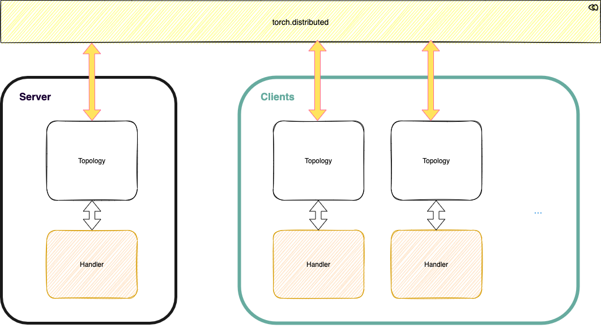
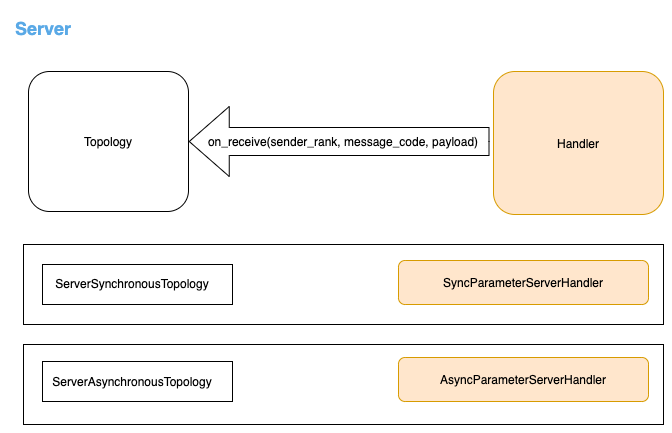

# FedLab: A Flexible Federated Learning Framework

## Table of Contents

## Introduction

FedLab是一个基于pytorch的轻量级、组件化联邦学习框架，帮助使用者在单机或多机环境下快速实现联邦学习算法的模拟。  
框架分为server和client两部分，每个角色又划分为Topology和Handler两个模块。其中，Topology模块基于torch.distributed实现，负责网络通信和消息预处理，并将处理好的信息通过预设的接口传递到底层。Handler模块负责定义优化算法，模型参数处理等工作。  

### Server
server端Topology与Handler的关系如下图，Topology处理信息并调用Handler.on_receive方法，Handler消息处理逻辑和模型更新算法。  

FedLab提供了同步联邦和异步联邦server端的demo

### Client

## Docs
文档：https://fedlab-fedlab.readthedocs-hosted.com/en/latest/

## Quick Start
1. 配置python环境
> pip install -r requirements.txt  
2. 运行FedAvg demo
> bash test.sh

## Citation
