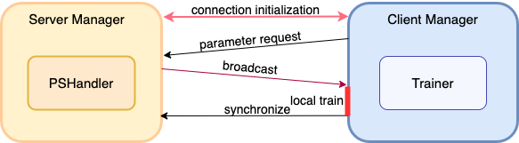
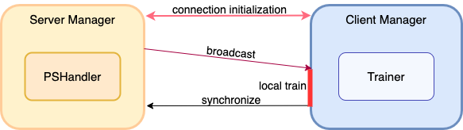

# FedLab: A Flexible Federated Learning Framework

[](https://fedlab-fedlab.readthedocs-hosted.com/en/latest/?badge=latest) 
[](https://codecov.io/gh/SMILELab-FL/FedLab)

## Introduction

FedLab是一个基于pytorch的轻量级、组件化联邦学习框架，帮助使用者在单机或多机环境下快速实现联邦学习算法的模拟。  
框架分为server和client两部分，server和client都由NetworkManager模块用于通信和消息处理，NetworkManager模块基于[torch.distributed](https://pytorch.org/docs/stable/distributed.html)实现的分布式点对点通信模块，负责消息处理和调用后端。 server的后端计算逻辑由ParameterServerHandler负责，client的后端计算由trainer负责。Manager模块构成通信协议和压缩框架，ParameterServer和Trainer构成联邦学习和优化框架。  
FedLab提供了一系列构建联邦学习系统的组件和Demo，主要分为同步联邦学习和异步联邦学习，并实现了常见的联邦学习算法Benchmarks。


### Server
server端NetworkManager与ParameterServer的关系如下图，NetworkManager处理信息并调用ParameterServer.on_receive方法，ParameterServer处理上层调用并更新全局模型(Global Model)。  


### Client

client端架构和各模块功能类似于server端，但NetworkManager和Trainer的功能和处理细节不同。client端后端统一为Trainer，向上层提供底层模型的训练算法调用，用于定义torch模型训练流程。NetworkManager管理前后端逻辑协调和消息处理。

  

### Communication
其中，异步和同步联邦的Network Manager通信逻辑如下图。  
1. 同步联邦学习中，一轮学习的启动由server主导，即server执行参与者采样（sample clients），广播全局模型参数。
2. 异步联邦中由client主导，即client向联邦服务器请求当前模型参数，进行本地模型训练。  



## Experiment Scene
FedLab支持多机和单机联邦学习系统的部署和模拟。

### Standalone

串行训练器，使用一个进程资源进程多client联邦模拟：


### Cross Machine
多进程模拟，在一台机器或多个机器上执行多个联邦脚本：


### Hierarchical
分层联邦通信，添加scheduler做消息转发，构建跨局域网域联邦，或自定义scheduler功能作为middle-server，构成负载均衡，满足扩展性，可用于大规模联邦学习模拟。同时scheduler满足跨局域网消息转发的功能，因此FedLab支持跨域联邦。
  

## How to start FedLab？


### Quick Start
1. 配置python环境：
```shell
pip install -r requirements.txt
```
2. 进入./fedlab_benchmarks/algorithm/fedavg/， 运行FedAvg demo：
```shell
bash run.sh 
```

### Code Architecture
FedLab的代码结构和功能如下：  
- fedlab_benchmarks: 基于FedLab的算法实现
  - algorithm
  - datasets
- fedlab_core: FedLab的基础组件  
  - client
  - server
  - hierarchical
  - communicator
- fedlab_utils:  FedLab静态工具类和函数
  - dataset

  
### Documentation
Coming soon

## Citation
如果你的工作用到了FedLab，请引用
```bibtex
@article{smile2021fedlab,  
    title={FedLab: A Flexible Federated Learning Framework},  
    author={Dun Zeng, Siqi Liang, Xiangjing Hu and Zenglin Xu},  
    journal={arXiv preprint arXiv:2107.11621},  
    year={2021}
}
```


## Contribution Guidance
欢迎提交pull request贡献代码。
- 代码应遵循[Apache License, Version 2.0](https://www.apache.org/licenses/LICENSE-2.0.html)协议。   
- 代码注释规范遵守docstring规范[中文版](https://zh-google-styleguide.readthedocs.io/en/latest/google-python-styleguide/python_style_rules/)|[English](https://google.github.io/styleguide/pyguide.html)