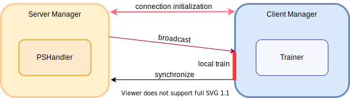

.. _examples:

Examples
=======================

FedLab standardizes FL simulation procedure, including synchronous algorithm, asynchronous
algorithm and communication compression. FedLab provides modular tools and standard implementations
to simplify FL research. Users can quickly learn about FedLab from our standard implementation.
Please follow `Quick Start`_ and `Customization`_ to learn more.

Quick Start
^^^^^^^^^^^^
Run quick start demo following commands:

.. code-block:: shell-session

    $ cd fedlab_benchamrks/algorithm/fedavg/cross_machine/
    $ bash quick_start.sh

to start a FL simulation with 1 server and 2 clients, communicating through localhost with each
other and following FedAvg optimization algorithm.

Follow commands below, run a asynchronous FL simulation with 1 server and 2 clients.

.. code-block:: shell-session

   $ cd fedlab_benchamrks/algorithm/fedasgd/
   $ bash quick_start.sh

Finally, the demo of ``SerialTrainer`` is in fedlab_benchamrks/algorithm/fedavg/standalone/standalone.py.

Customization
^^^^^^^^^^^^^^

Network Configuration
----------------------
FedLab uses `torch.distributed <https://pytorch.org/docs/stable/distributed.html>`_ as
point-to-point communication package. The communication backend is Gloo as default. FedLab processes
send/receive data through TCP network connection. If the automatically detected interface is not
correct, you need to choose the network interface to use for Gloo, by setting the environment
variables ``GLOO_SOCKET_IFNAME``, for example ``export GLOO_SOCKET_IFNAME=eth0`` or
``os.environ['GLOO_SOCKET_IFNAME'] = "eth0"``.

.. note::
   Check the available ethernet:

   .. code-block:: shell-session

       $ ifconfig

You need to assign right ethernet to ``DistNetwork``, making sure ``torch.distributed``
network initialization works. ``DistNetwork`` is for quickly network configuration, which you
can create one as follows:

.. code-block:: python

    from fedlab.core.network import DistNetwork
    world_size = 10
    rank = 0  # 0 for server, other rank for clients
    ethernet = 'eth0'
    server_ip = '127.0.0.1'
    server_port = 1234
    network = DistNetwork(address=(server_ip, server_port), world_size, rank, ethernet)

.. note::
   - The ``(server_ip, server_port)`` is the address of server (its rank is ``0`` by default).
   - Make sure ``world_size`` is the same across process.
   - Rank should be different (from ``0`` to ``world_size-1``).
   - The ``ethernet_name`` must be right (``ifconfig``). Otherwise, network initialization would
     fail.

Optimization Customization
---------------------------

Standard FL Optimization contains two parts: 1. local train in client; 2. global aggregation in
server.  Local train and aggregation procedure are customizable in FedLab. You need to define
``ClientTrainer`` and ``ParameterServerBackendHandler``.

.. note::
   1. overwrite ``ClientTrainer.train()`` to define local train procedure. Typically, you need to
      implement standard training pipeline of PyTorch.
   2. ``ParameterServerBackendHandler`` defines hyperparameter of FL system such as
      ``stop_condition()``, ``sample_clients()`` and so on.
   3. You can overwrite "ParameterServerBackendHandler._update_model(serialized_params_list)" to
      customize aggregation procedure. Typically, you can define aggregator functions as FedLab
      implemented in ``fedlab\utils\aggregator.py`` which used in FedLab standard implementations.

.. code-block:: python

    # ClientTrainer
    trainer = ClientSGDTrainer(model, trainloader, epochs, optimizer, criterion, cuda, logger)

    # ParameterServerBackendHandler
    handler = SyncParameterServerHandler(model, client_num_in_total, global_round, logger, sample_ratio)

Communication Customization
----------------------------

Communication control flow and data flow are managed by ``NetworkManager``. Typically, standard
implementations is shown in ``fedlab\core\client\manager.py`` and ``fedlab\core\server\manager.py``.

The prototype of ``NetworkManager`` is defined in ``fedlab\core\network_manager.py``, which is
also a subclass of ``torch.multiprocessing.process``.  ``NetworkManager`` manage network connection
and data send/receive process. For instance, ``NetworkManager.setup()`` is for network
initialization procedure and ``NetworkManager.on_receive(self, sender, message_code, payload)`` is
for control flow definition.

FedLab provides 2 standard communication pattern implementations: synchronous and asynchronous.
You can customization process flow by 1. create a new class inherited from corresponding class in
our standard implementations. 2. overwrite the functions in target communication stage.

Synchronous is given by :py:class:`ServerSynchronousManager` and :py:class:`ClientPassiveManager`. Communication
procedure is shown as follows.

.. note::
   1. overwrite ``setup()`` in both ServerSynchronousManager and ClientPassiveManager to define
      initialization procedure.
   2. overwrite ``activate_clients()`` in ``ServerSynchronousManager`` to customize broadcast stage.
   3. overwrite ``on_receive(self, sender, message_code, payload)`` in ``ServerSynchronousManager``
      and ``ClientPassiveManager`` to customize control flow.
   4. overwrite ``synchronize()`` in ``ClientPassiveManager`` to customize synchronize procedure.

Asynchronous is given by ``ServerAsynchronousManager`` and ``ClientActiveManager``. Communication
procedure is shown as follows.

.. image:: ../imgs/fedlab-asynchronous.svg
   :align: center

.. note::
   1. overwrite ``setup()`` in both client and server to define initialization procedure.
   2. overwrite ``request_model`` in ``ClientActiveManager`` to customize request procedure.
   3. overwrite ``on_receive(self, sender, message_code, payload)`` in
      ``ServerAsynchronousManager`` and ``ClientActiveManager`` to customize control flow.
   4. overwrite ``synchronize()`` in ``ClientActiveManager`` to customize synchronize procedure.

