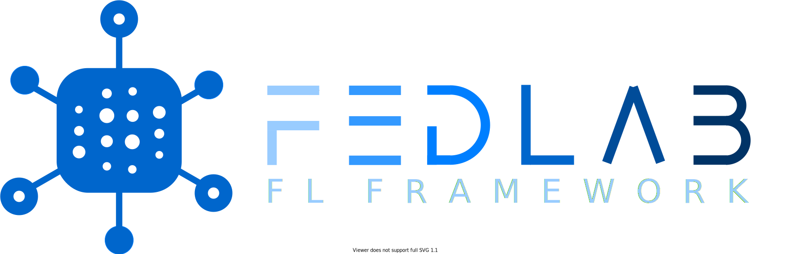

.. FedLab documentation master file, created by
   sphinx-quickstart on Wed Mar 10 15:04:04 2021.
   You can adapt this file completely to your liking, but it should at least
   contain the root `toctree` directive.

==================================

==================================

FedLab provides the necessary modules for FL simulation, including communication, compression, model optimization, data partition and other functional modules. Users can build FL simulation environment with custom modules like playing with LEGO bricks.

.. toctree::
   :maxdepth: 1
   :caption: Contents:

   overview
   install
   tutorials/tutorial
   examples/example
   contributing
   reference

Gallery
.......
.. grid:: 1 2 2 2

    .. grid-item::

        .. card:: FedAvg-MNIST Accuracy
            :text-align: center
            :shadow: md
            :img-bottom: ../imgs/ex-results/fedavg-CNN-MLP-acc-dark.png
            :class-card: sd-rounded-3
            :link: tutorial
            :link-type: ref

    .. grid-item::

        .. card:: FedAvg-MNIST Loss
            :text-align: center
            :shadow: md
            :img-bottom: ../imgs/ex-results/fedavg-CNN-MLP-loss-dark.png
            :class-card: sd-rounded-3
            :link: tutorial
            :link-type: ref

Citation
........

Please cite **FedLab** in your publications if it helps your research:

.. code:: latex
    
    @article{smile2021fedlab,  
    title={FedLab: A Flexible Federated Learning Framework},  
    author={Dun Zeng, Siqi Liang, Xiangjing Hu and Zenglin Xu},  
    journal={arXiv preprint arXiv:2107.11621},  
    year={2021}
    }

Contacts
........

Contact the **FedLab** development team through Github issues or email:

- Dun Zeng: zengdun@foxmail.com

- Siqi Liang: zszxlsq@gmail.com
    
