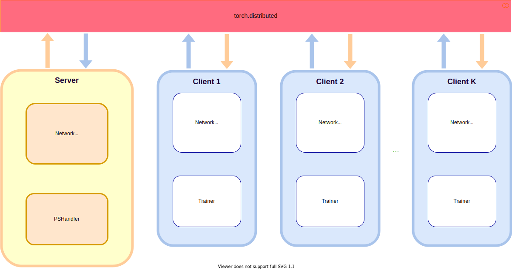
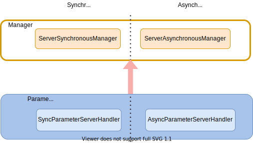
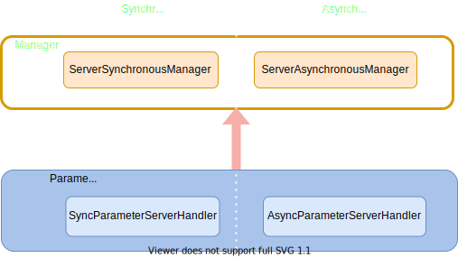
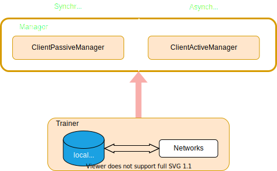
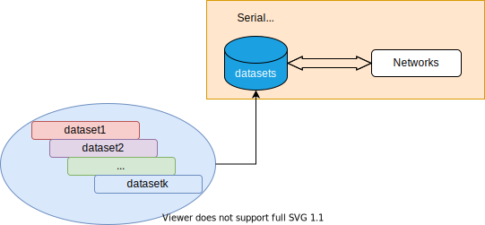
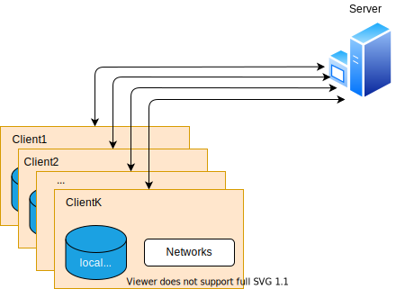
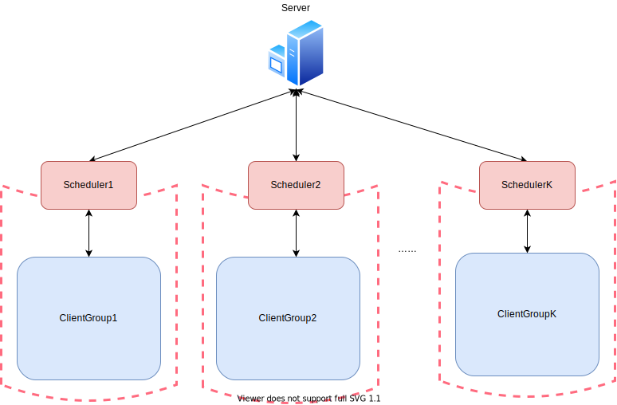
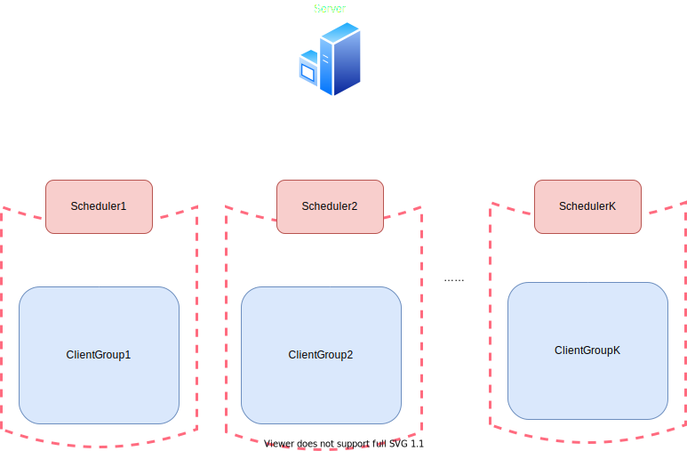

******************
Overview of FedLab
******************

Introduction
============

Federated learning (FL), proposed by Google at the very beginning, is recently a burgeoning research area of machine learning, which aims to protect individual data privacy in distributed machine learning process, especially in finance, smart healthcare and edge computing. Different from traditional data-centered distributed machine learning, participants in FL setting utilize localized data to train local model, then leverages specific strategies with other participants to acquire the final model collaboratively, avoiding direct data sharing behavior.

To relieve the burden of researchers in implementing FL algorithms and emancipate FL scientists from repetitive implementation of basic FL setting, we introduce highly customizable framework **FedLab** in this work. **FedLab** is builded on the top of `torch.distributed <https://pytorch.org/docs/stable/distributed.html>`_ modules and provides the necessary modules for FL simulation, including communication, compression, model optimization, data partition and other functional modules. **FedLab** users can build FL simulation environment with custom modules like playing with LEGO bricks. For better understanding and easy usage, FL algorithm benchmark implemented in **FedLab** are also presented.

For more details, please read our `full paper`__.

.. __: https://arxiv.org/abs/2107.11621

Overview
========

**FedLab** provides two basic roles in FL setting: ``Server`` and ``Client``. Each ``Server``/``Client`` consists of two components called ``NetworkManager`` and ``ParameterHandler``/``Trainer``.

- ``NetworkManager`` module manages message process task, which provides interfaces to customize communication agreements and compression.

- ``ParameterHandler`` is responsible for backend computation in ``Server``; and ``Trainer`` is in charge of backend computation in ``Client``.

Server
------

The connection between ``NetworkManager`` and ``ParameterServerHandler`` in ``Server`` is shown as below. ``NetworkManager`` processes message and calls ``ParameterServerHandler.on_receive()`` method, while ``ParameterServerHandler`` performs training as well as computation process of server (model aggregation for example), and updates the global model.

Client
------

``Client`` shares similar design and structure with ``Server``, with ``NetworkManager`` in charge of message processing as well as network communication with server, and `Trainer` for client local training procedure.

.. image:: ../imgs/fedlab-client.svg
   :align: center
   :class: only-light

Communication
-------------

**FedLab** furnishes both synchronous and asynchronous communication patterns, and their corresponding communication logics of ``NetworkManager`` is shown as below.

1. Synchronous FL: each round is launched by server, that is, server performs clients sampling first then broadcasts global model parameters.

   .. image:: ../imgs/fedlab-synchronous.svg
      :align: center
      :class: only-light

   .. image:: ../imgs/fedlab-synchronous-dark.svg
      :align: center
      :class: only-dark

2. Asynchronous FL :cite:p:`xie2019asynchronous`: each round is launched by clients, that is, clients request current global model parameters then perform local training.

   .. image:: ../imgs/fedlab-asynchronous.svg
      :align: center
      :class: only-light

   .. image:: ../imgs/fedlab-asynchronous-dark.svg
      :align: center
      :class: only-dark

Experimental Scene
==================

**FedLab** supports both single machine and  multi-machine FL simulations, with **standalone** mode for single machine experiments, while cross-machine mode and **hierarchical** mode for multi-machine experiments.

Standalone
-----------

**FedLab** implements ``SerialTrainer`` for FL simulation in single system process. ``SerialTrainer`` allows user to simulate a FL system with multiple clients executing one by one in serial in one ``SerialTrainer``. It is designed for simulation in environment with limited computation resources.

Cross-process
-------------

**FedLab** enables FL simulation tasks to be deployed on multiple processes with correct network configuration (these processes can be run on single or multiple machines). More flexibly in parallel, ``SerialTrainer`` can replace the regular ``Trainer`` directly. Users can balance the calculation burden among processes by choosing different ``Trainer``. In practice, machines with more computation resources can be assigned with more workload of calculation.

.. note::

   All machines must be in the same network (LAN or WAN) for cross-process deployment.

.. image:: ../imgs/fedlab-multi_process-dark.svg
   :align: center
   :class: only-dark

Hierarchical
------------

**Hierarchical** mode for **FedLab** is designed for situation tasks on multiple computer clusters (in different LAN) or the real-world scenes. To enable the inter-connection for different computer clusters, **FedLab** develops ``Scheduler`` as middle-server process to connect client groups. Each ``Scheduler`` manages the communication between the global server and clients in a client group. And server can communicate with clients in different LAN via corresponding ``Scheduler``. The computation mode of a client group for each scheduler can be either **standalone** or **cross-process**.

A hierarchical FL system with ``K`` client groups is depicted as below.

Benchmarks
==========

**FedLab** also contains data partition scripts from LEAF :cite:p:`caldas2018leaf`, and implementations of some FL algorithms, like FedAvg :cite:p:`mcmahan2017communication`. More benchmarks and FL algorithms demos are coming.

How to use FedLab?
==================

- :ref:`installation`.
- :ref:`tutorial`.

