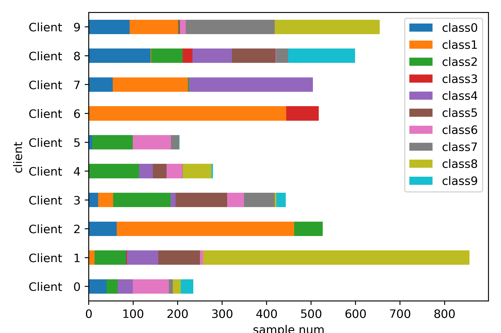
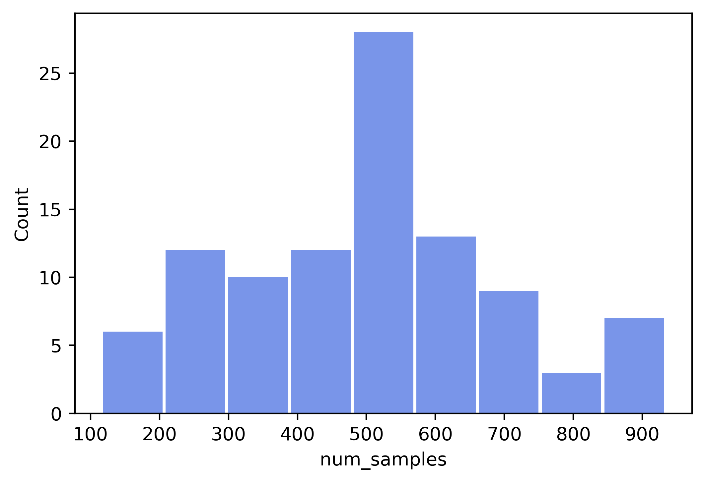
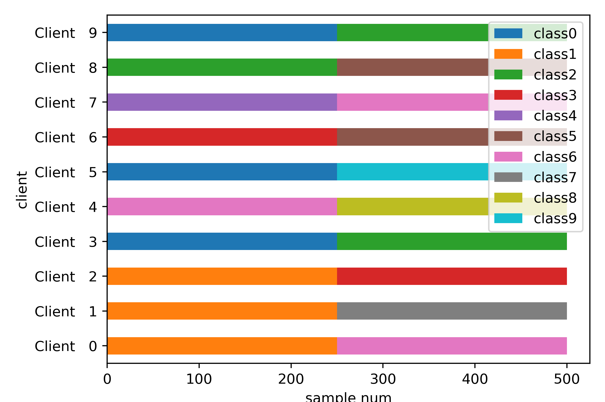
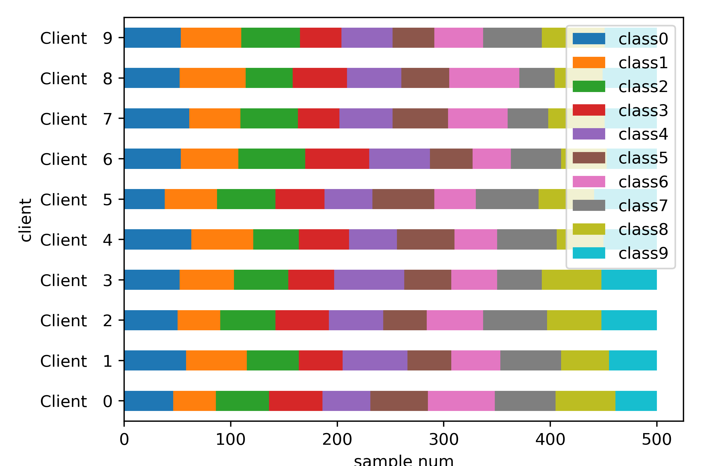
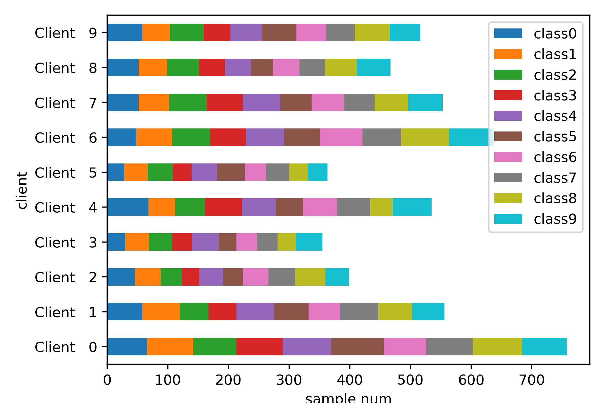
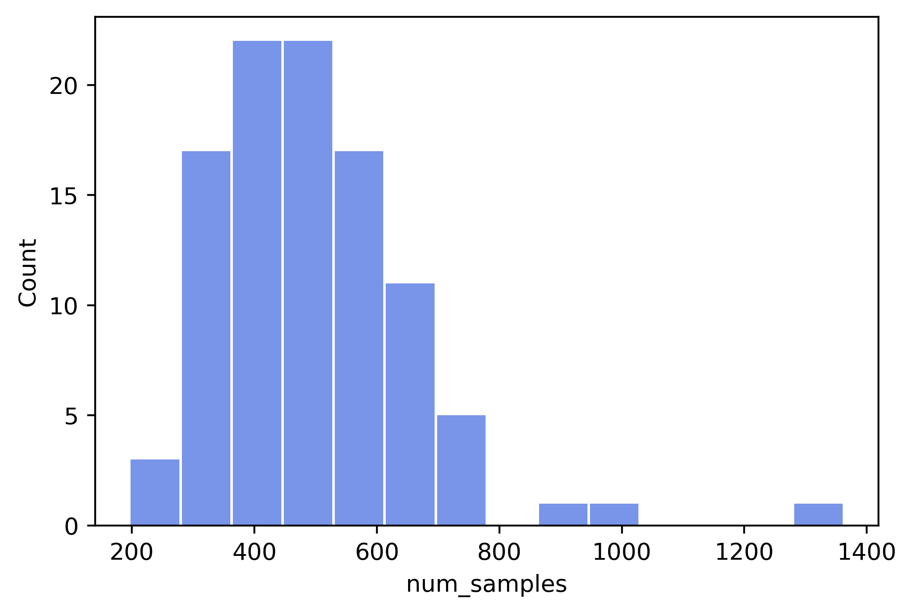
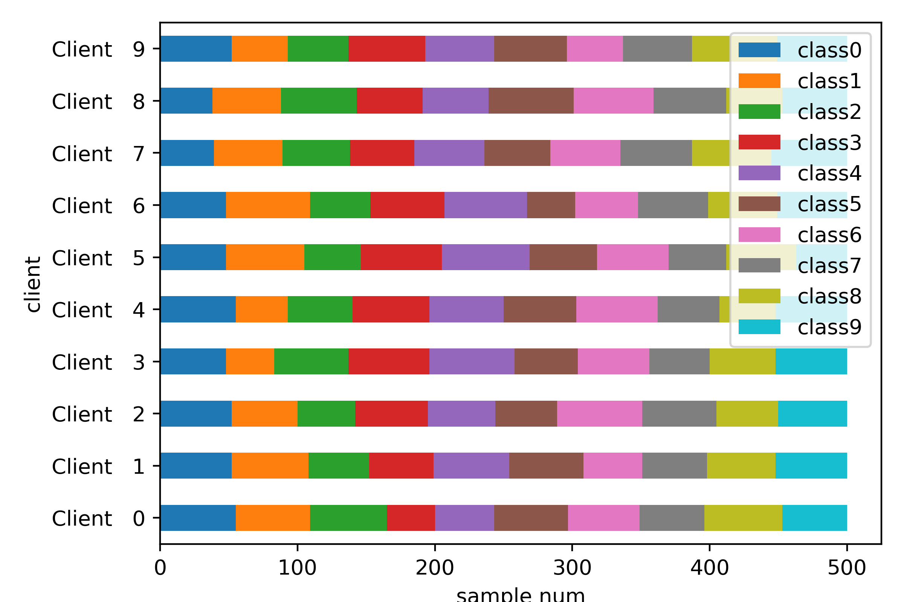

.. _data-cifar10:

******************
CIFAR10Partitioner
******************

For CIFAR10, we provides 6 pre-defined partition schemes. We partition CIFAR10 with the following parameters:

- ``targets`` is labels of dataset to partition
- ``num_clients`` specifies number of clients in partition scheme
- ``balance`` refers to FL scenario that sample numbers for different clients are the same
- ``partition`` specifies partition scheme name
- ``unbalance_sgm`` is parameter for unbalance partition
- ``num_shards`` is parameter for non-iid partition using shards
- ``dir_alpha`` is parameter for Dirichlet distribution used in partition
- ``verbose`` controls whether to print intermediate information
- ``seed`` sets the random seed

Each partition scheme can be applied on CIFAR10 using different combinations of parameters:

- ``balance=None``: do not specify sample numbers for each clients in advance

  - ``partition="dirichlet"``: non-iid partition used in
    :cite:t:`yurochkin2019bayesian` and :cite:t:`wang2020federated`. ``dir_alpha`` need to be specified in this partition scheme

  - ``partition="shards"``: non-iid method used in FedAvg :cite:p:`mcmahan2017communication`. Refer to :func:`fedlab.utils.dataset.functional.shards_partition` for more information. ``num_shards`` need to be specified here.

- ``balance=True``: "Balance" refers to FL scenario that sample numbers for different clients are the same. Refer to :func:`fedlab.utils.dataset.functional.balance_partition` for more information. This partition scheme is from :cite:t:`acar2020federated`.

  - ``partition="iid"``: Random select samples from complete dataset given sample number for each client.

  - ``partition="dirichlet"``: Refer to :func:`fedlab.utils.dataset.functional.client_inner_dirichlet_partition` for more information. ``dir_alpha`` need to be specified in this partition scheme

- ``balance=False``: "Unbalance" refers to FL scenario that sample numbers for different clients are different. For unbalance method, sample number for each client is drown from Log-Normal distribution with variance ``unbalanced_sgm``. When ``unbalanced_sgm=0``, partition is balanced. This partition scheme is from :cite:t:`acar2020federated`.

  - ``partition="iid"``: Random select samples from complete dataset given sample number for each client.

  - ``partition="dirichlet"``: Given sample number of each client, use Dirichlet distribution for each client's class distribution. ``dir_alpha`` need to be specified in this partition scheme

To conclude, 6 pre-defined partition schemes can be summarized as:

- Hetero Dirichlet (non-iid)
- Shards (non-iid)
- Balanced IID (iid)
- Unbalanced IID (iid)
- Balanced Dirichlet (non-iid)
- Unbalanced Dirichlet (non-iid)

Now, we introduce how to use these pre-defined partition on CIFAR10 in FL setting with 100 clients, and provide statistical plots for each scheme.

First, import related package and basic setting:

.. code-block:: python

    import torch
    import torchvision

    import numpy as np
    import pandas as pd
    import matplotlib.pyplot as plt
    import seaborn as sns
    import sys

    from fedlab.utils.dataset.partition import CIFAR10Partitioner
    from fedlab.utils.functional import partition_report, save_dict

    num_clients = 100
    num_classes = 10
    seed = 2021
    hist_color = '#4169E1'

Second, we need to load CIFAR10 dataset from ``torchvision``:

.. code-block:: python

    trainset = torchvision.datasets.CIFAR10(root="../../../../data/CIFAR10/",
                                            train=True, download=True)

Hetero Dirichlet
^^^^^^^^^^^^^^^^

Perform partition:

.. code-block:: python

    hetero_dir_part = CIFAR10Partitioner(trainset.targets,
                                         num_clients,
                                         balance=None,
                                         partition="dirichlet",
                                         dir_alpha=0.3,
                                         seed=seed)

``hetero_dir_part.client_dict`` is a dictionary like this：

.. code-block:: python

    hetero_dir_part.client_dict= { 0: indices of dataset,
                                   1: indices of dataset,
                                   ...
                                   100: indices of dataset }

For visualization and check partition result, we generate partition report for current partition, and save it into csv file:

.. code-block:: python

    csv_file = "./partition-reports/cifar10_hetero_dir_0.3_100clients.csv"
    partition_report(trainset.targets, hetero_dir_part.client_dict,
                     class_num=num_classes,
                     verbose=False, file=csv_file)

Report generated here is like:

.. code-block::

    Class frequencies:
    client,class0,class1,class2,class3,class4,class5,class6,class7,class8,class9,Amount
    Client   0,0.170,0.00,0.104,0.00,0.145,0.004,0.340,0.041,0.075,0.120,241
    Client   1,0.002,0.015,0.083,0.003,0.082,0.109,0.009,0.00,0.695,0.00,863
    Client   2,0.120,0.759,0.122,0.00,0.00,0.00,0.00,0.00,0.00,0.00,526
    ...

which can be easily parsed by :func:`csv.reader` or :func:`pandas.read_csv`:

.. code-block:: python

    hetero_dir_part_df = pd.read_csv(csv_file,header=1)
    hetero_dir_part_df = hetero_dir_part_df.set_index('client')
    col_names = [f"class{i}" for i in range(num_classes)]
    for col in col_names:
        hetero_dir_part_df[col] = (hetero_dir_part_df[col] * hetero_dir_part_df['Amount']).astype(int)

Now, select the first 10 clients for class distribution bar plot:

.. code-block:: python

    hetero_dir_part_df[col_names].iloc[:10].plot.barh(stacked=True)
    plt.tight_layout()
    plt.xlabel('sample num')
    plt.savefig(f"./imgs/cifar10_hetero_dir_0.3_100clients.png", dpi=400)

We also can check sample number statistic result for all clients:

.. code-block:: python

    clt_sample_num_df = hetero_dir_part.client_sample_count
    sns.histplot(data=clt_sample_num_df,
                 x="num_samples",
                 edgecolor='none',
                 alpha=0.7,
                 shrink=0.95,
                 color=hist_color)
    plt.savefig(f"./imgs/cifar10_hetero_dir_0.3_100clients_dist.png", dpi=400, bbox_inches = 'tight')

Shards
^^^^^^

Perform partition:

.. code-block:: python

    num_shards = 200
    shards_part = CIFAR10Partitioner(trainset.targets,
                                     num_clients,
                                     balance=None,
                                     partition="shards",
                                     num_shards=num_shards,
                                     seed=seed)

Class distribution bar plot:

Balanced IID
^^^^^^^^^^^^

Perform partition:

.. code-block:: python

    balance_iid_part = CIFAR10Partitioner(trainset.targets,
                                          num_clients,
                                          balance=True,
                                          partition="iid",
                                          seed=seed)

Class distribution bar plot:

Unbalanced IID
^^^^^^^^^^^^^^

Perform partition:

.. code-block:: python

    unbalance_iid_part = CIFAR10Partitioner(trainset.targets,
                                            num_clients,
                                            balance=False,
                                            partition="iid",
                                            unbalance_sgm=0.3,
                                            seed=seed)

Class distribution bar plot:

Sample number statistic result for clients:

Balanced Dirichlet
^^^^^^^^^^^^^^^^^^

Perform partition:

.. code-block:: python

    balance_dir_part = CIFAR10Partitioner(trainset.targets,
                                          num_clients,
                                          balance=True,
                                          partition="dirichlet",
                                          dir_alpha=0.3,
                                          seed=seed)

Class distribution bar plot:

Unbalanced Dirichlet
^^^^^^^^^^^^^^^^^^^^

Perform partition:

.. code-block:: python

    unbalance_dir_part = CIFAR10Partitioner(trainset.targets,
                                            num_clients,
                                            balance=False,
                                            partition="dirichlet",
                                            unbalance_sgm=0.3,
                                            dir_alpha=0.3,
                                            seed=seed)

Class distribution bar plot:

Sample number statistic result for clients:

.. image:: ../../imgs/data-partition/cifar10_unbalance_dir_alpha_0.3_unbalance_sgm_0.3_100clients_dist.png
   :align: center
   :width: 300

.. note::

    For complete usage example of :class:`CIFAR10Partitioner`, check FedLab benchmark `datasets part <https://github.com/SMILELab-FL/FedLab-benchmarks/tree/main/fedlab_benchmarks/datasets/cifar10/>`_.

SubsetSampler
=============

By using torch's sampler, only the right part of the sample is taken from the overall dataset.

.. code-block:: python

    from fedlab.utils.dataset.sampler import SubsetSampler

    train_loader = torch.utils.data.DataLoader(trainset,
                                               sampler=SubsetSampler(indices=partition[client_id], shuffle=True),
                                               batch_size=batch_size)

There is also a similar implementation of directly reordering and partition the dataset, see :class:`fedlab.utils.dataset.sampler.RawPartitionSampler` for details.

In addition to dividing the dataset by the sampler of torch, dataset can also be divided directly by splitting the dataset file. The implementation can refer to FedLab version of LEAF.
