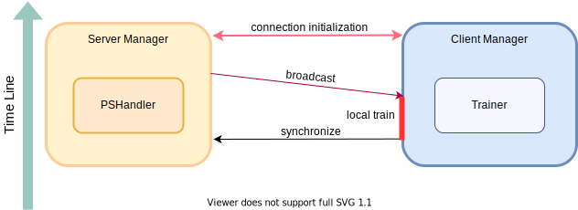
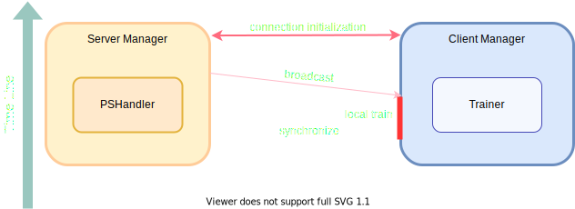
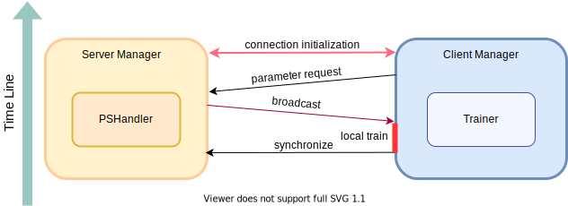

.. _communication-strategy:

**********************
Communication Strategy
**********************

Communication strategy is implemented by ClientManager and ServerManager collaboratively.

The prototype of :class:`NetworkManager` is defined in ``fedlab.core.network_manager``, which is also a subclass of ``torch.multiprocessing.process``.

Typically, standard implementations is shown in ``fedlab.core.client.manager`` and ``fedlab.core.server.manager``. :class:`NetworkManager` manages network operation and control flow procedure.

Base class definition shows below:

.. code-block:: python

    class NetworkManager(Process):
        """Abstract class

        Args:
            newtork (DistNetwork): object to manage torch.distributed network communication.
        """

        def __init__(self, network):
            super(NetworkManager, self).__init__()
            self._network = network

        def run(self):
            """
            Main Process:
                1. Initialization stage.

                2. FL communication stage.

                3. Shutdown stage, then close network connection.
            """
            self.setup()
            self.main_loop()
            self.shutdown()

        def setup(self, *args, **kwargs):
            """Initialize network connection and necessary setups.

            Note:
                At first, ``self._network.init_network_connection()`` is required to be called.
                Overwrite this method to implement system setup message communication procedure.
            """
            self._network.init_network_connection()

        def main_loop(self, *args, **kwargs):
            """Define the actions of communication stage."""
            raise NotImplementedError()

        def shutdown(self, *args, **kwargs):
            """Shut down stage"""
            self._network.close_network_connection()

FedLab provides 2 standard communication pattern implementations: synchronous and asynchronous. You can customize process flow by: 1. create a new class inherited from corresponding class in our standard implementations; 2. overwrite the functions in target stage.

To sum up, communication strategy can be customized by overwriting as the note below mentioned.

.. note::

    1. :meth:`setup()` defines the network initialization stage. Can be used for FL algorithm initialization.
    2. :meth:`main_loop()` is the main process of client and server. User need to define the communication strategy for both client and server manager.
    3. :meth:`shutdown()` defines the shutdown stage.

Importantly, ServerManager and ClientManager should be defined and used as a pair. The control flow and information agreements should be compatible. FedLab provides standard implementation for typical synchronous and asynchronous, as depicted below.

Synchronous
============

Synchronous communication involves :class:`ServerSynchronousManager` and :class:`ClientPassiveManager`. Communication procedure is shown as follows.

Asynchronous
=============

Asynchronous is given by :class:`ServerAsynchronousManager` and :class:`ClientActiveManager`. Communication
procedure is shown as follows.

.. image:: ../../imgs/fedlab-asynchronous-dark.svg
    :align: center
    :class: only-dark

Initialization stage
====================

Initialization stage is represented by :meth:`manager.setup()` function.

User can customize initialization procedure as follows(use ClientManager as example):

.. code-block:: python

    from fedlab.core.client.manager import ClientPassiveManager

    class CustomizeClientManager(ClientPassiveManager):

        def __init__(self, trainer, network):
            super().__init__(trainer, network)

        def setup(self):
            super().setup()
            *****************************
            *                           *
            *      Write Code Here      *
            *                           *
            *****************************
    
Communication stage
===================

After Initialization Stage, user can define :meth:`main_loop()` to define main process for server and client. To standardize
**FedLab**'s implementation, here we give the :meth:`main_loop()` of :class:`ClientPassiveManager`: and :class:`ServerSynchronousManager` for example.

**Client part**:

.. code-block:: python

    def main_loop(self):
        """Actions to perform when receiving new message, including local training

        Main procedure of each client:
            1. client waits for data from server （PASSIVELY）
            2. after receiving data, client trains local model.
            3. client synchronizes with server actively.
        """
        while True:
            sender_rank, message_code, payload = self._network.recv(src=0)
            if message_code == MessageCode.Exit:
                break
            elif message_code == MessageCode.ParameterUpdate:
                model_parameters = payload[0]
                self._trainer.train(model_parameters=model_parameters)
                self.synchronize()
            else:
                raise ValueError("Invalid MessageCode {}. Please see MessageCode Enum".format(message_code))

**Server Part**:

.. code-block:: python

    def main_loop(self):
        """Actions to perform in server when receiving a package from one client.

        Server transmits received package to backend computation handler for aggregation or others
        manipulations.

        Loop:
            1 activate clients.

            2 listen for message from clients -> transmit received parameters to server backend.

        Note:
            Communication agreements related: user can overwrite this function to customize
            communication agreements. This method is key component connecting behaviors of
            :class:`ParameterServerBackendHandler` and :class:`NetworkManager`.

        Raises:
            Exception: Unexpected :class:`MessageCode`.
        """
        while self._handler.stop_condition() is not True:
            activate = threading.Thread(target=self.activate_clients)
            activate.start()
            while True:
                sender, message_code, payload = self._network.recv()
                if message_code == MessageCode.ParameterUpdate:
                    model_parameters = payload[0]
                    if self._handler.add_model(sender, model_parameters):
                        break
                else:
                    raise Exception(
                        raise ValueError("Invalid MessageCode {}. Please see MessageCode Enum".format(message_code))

Shutdown stage
=================

:meth:`shutdown()` will be called when :meth:`main_loop()` finished. You can define the actions for client and server seperately.

Typically in our implementation, shutdown stage is started by server. It will send a package with ``MessageCode.Exit`` to
inform client to stop its main loop.

Codes below is the actions of :class:`ServerSynchronousManager` in shutdown stage.

.. code-block:: python

    def shutdown(self):
        self.shutdown_clients()
        super().shutdown()

    def shutdown_clients(self):
        """Shut down all clients.

        Send package to every client with :attr:`MessageCode.Exit` to client.
        """
        for rank in range(1, self._network.world_size):
            print("stopping clients rank:", rank)
            self._network.send(message_code=MessageCode.Exit, dst=rank)

.. note::

    The scale module of **FedLab** is a communication strategy re-definition to both ClientManager and ServerManager. Please see the source code in fedlab/core/{client or server}/scale/manager.py (It it really simple. We did nothing but add a map function from rank to client id).

