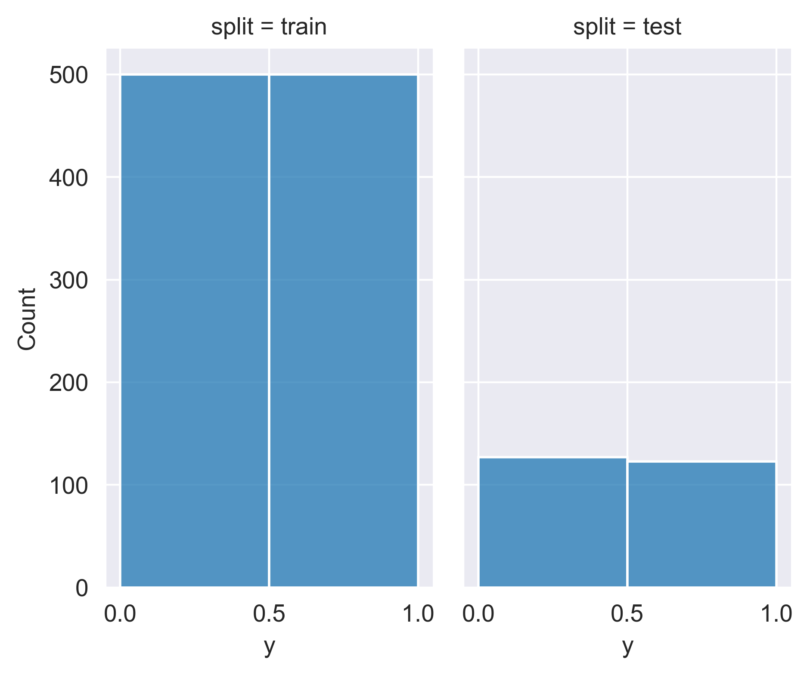
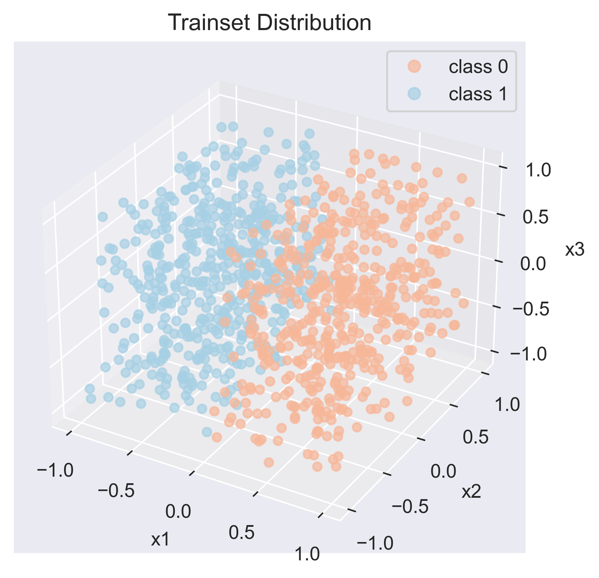
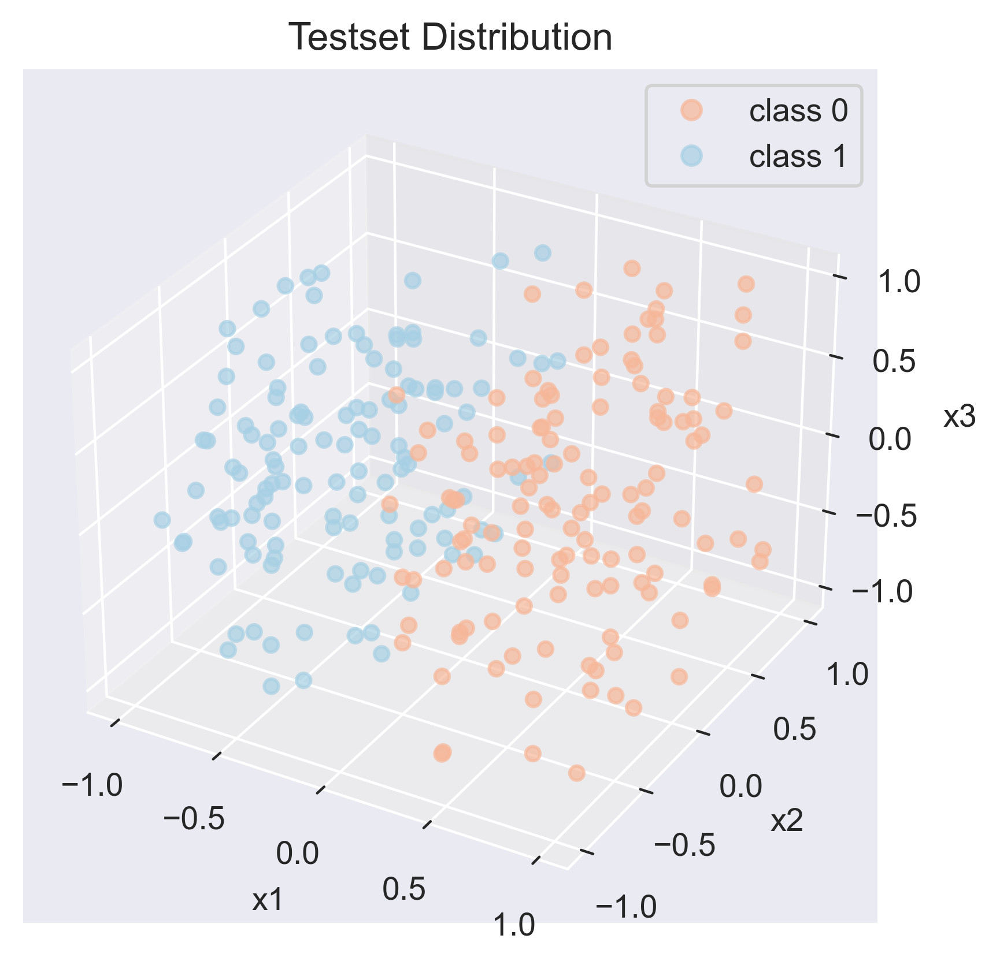

.. _fcube-tutorial:

*****
FCUBE
*****

FCUBE :cite:p:`li2021federated` is a synthetic dataset for research in non-IID scenario with feature imbalance. This dataset is proposed in `Federated Learning on Non-IID Data Silos: An Experimental Study <https://arxiv.org/abs/2102.02079>`_.

Data points of FCUBE conain 3 features, that is, :math:`\mathcal{D}_{\text{FCUBE}} = \{ (\mathbf{x}, y) \}`, where each data point :math:`\mathbf{x} = (x_1, x_2, x_3)`, and label :math:`y \in \{ 0, 1 \}`. The distribution of data points is a cube in three dimentions, and if :math:`x_1 > 0`, then :math:`y = 0`, while :math:`y=1` when :math:`x_1 < 0`. By default, we suggest 4000 data points for trainset, and 1000 for testset.

For more details, please refer to Section (IV-B-b) of original paper.

Dataset ``FCUBE`` will generate local ``.npy`` file if ``generate=True``. And it also accepts common arguments for dataset: ``transform`` and ``target_transform`` to transform the input and target respectively.

Import related package and basic setting:

.. code-block:: python

    from matplotlib import pyplot as plt
    from matplotlib.colors import ListedColormap
    from mpl_toolkits.mplot3d import Axes3D
    import seaborn as sns
    %matplotlib notebook
    import pandas as pd
    import numpy as np

    import sys

    import fedlab_benchmarks
    from fedlab_benchmarks.datasets import FCUBE

    import torch
    from torch.utils.data import DataLoader

    sns.set_style('darkgrid')

Dataset Generation
==================

Generate trainset:

.. code-block:: python

    trainset = FCUBE('../../../../data/FCUBE/', train=True, generate=True,
                 num_samples=1000)
    train_loader = DataLoader(trainset, batch_size=20, shuffle=True)

.. code-block::

    Generate FCUBE data now...
    ../../../../data/FCUBE/fcube_train_X_1000.npy generated.
    ../../../../data/FCUBE/fcube_train_y_1000.npy generated.

Generate testset:

.. code-block:: python

    testset = FCUBE('../../../../data/FCUBE/', train=False, generate=True,
                 num_samples=250)
    test_loader = DataLoader(testset, batch_size=20, shuffle=False)

.. code-block::

    Generate FCUBE data now...
    ../../../../data/FCUBE/fcube_test_X_250.npy generated.
    ../../../../data/FCUBE/fcube_test_y_250.npy generated.

Visualization
=============

For visualization, we first construct  ``DataFrame`` for dataset:

.. code-block:: python

    train_df = pd.DataFrame({'x1': trainset.data[:,0],
                         'x2': trainset.data[:,1],
                         'x3': trainset.data[:,2],
                         'y': trainset.targets,
                         'split': ['train'] * trainset.targets.shape[0]})
    test_df = pd.DataFrame({'x1': testset.data[:,0],
                            'x2': testset.data[:,1],
                            'x3': testset.data[:,2],
                            'y': testset.targets,
                            'split': ['test'] * testset.targets.shape[0]})
    fcube_df = pd.concat([train_df, test_df], ignore_index=True)

The class distribution in FCUBE is balanced. Visualization of class distribution in trainset/testset:

.. code-block:: python

    sns.displot(fcube_df, x="y", col="split", bins=2, height=4, aspect=.6)
    plt.savefig(f"../imgs/fcube_class_dist.png", dpi=400, bbox_inches = 'tight')

Data points distribution for trainset:

.. code-block:: python

    fig = plt.figure()
    ax = fig.add_subplot(111, projection = '3d')

    ax.set_xlabel("x1")
    ax.set_ylabel("x2")
    ax.set_zlabel("x3")

    # get colormap from seaborn
    cmap = ListedColormap(sns.color_palette("RdBu", 2).as_hex())

    ax.scatter(train_df['x1'], train_df['x2'], train_df['x3'], c=train_df['y'], marker='o',
               cmap=cmap,
               alpha=0.7)
    plt.title("Trainset Distribution")
    plt.show()
    plt.savefig("../imgs/fcube_train_dist_vis.png",  dpi=400, bbox_inches='tight')

Data points distribution for testset:

.. code-block:: python

    fig = plt.figure()
    ax = fig.add_subplot(111, projection = '3d')

    ax.set_xlabel("x1")
    ax.set_ylabel("x2")
    ax.set_zlabel("x3")

    # get colormap from seaborn
    cmap = ListedColormap(sns.color_palette("RdBu", 2).as_hex())

    scatter = ax.scatter(test_df['x1'], test_df['x2'], test_df['x3'], c=test_df['y'], marker='o',
               cmap=cmap,
               alpha=0.7)
    plt.legend(handles=scatter.legend_elements()[0], labels=['class 0','class 1'])
    plt.title("Testset Distribution")
    plt.show()
    plt.savefig("../imgs/fcube_test_dist_vis.png",  dpi=400, bbox_inches='tight')

