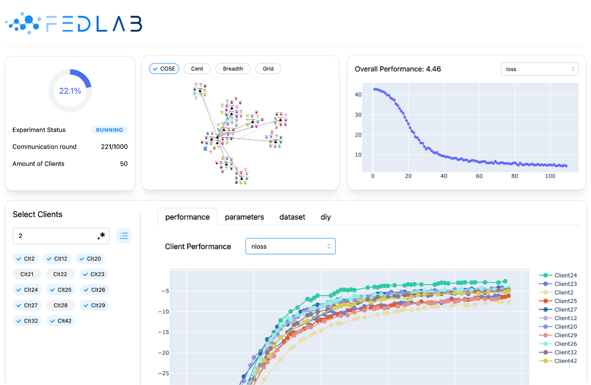

# FedBoard

Fedboard is a customizable visualization tool for Federated Learning



# Quick Start

## Install Dash

```shell
cd fedlab/board
pip install -r requirements.txt
```

## Set up

First, register the process to FedBoard

```python
fedboard.register(id='exp-01',
                  roles=CLIENT_HOLDER | SERVER,
                  client_ids=['0', '1', ...],
                  max_round=100,
                  process_rank=x)
```

- `id` specifies the experiment ID. All processes in one FL system must have the same `id`

- `roles` marks the roles of this process, which can be any combination of `[CLIENT_HOLDER, SERVER, BOARD_SHOWER]`.
    - Being a `CLIENT_HOLDER` means the process maintains client `Trainer` and should also pass its `clinet_ids` to
      FedBoard.
    - Being a `SERVER` means the process maintains server `Handler`
    - Being a `BOARD_SHOWER` means the FedBoard webpage runs on this process

- `client_ids` is only required when `roles` contains `CLIENT_HOLDER`
- `process_rank` the rank of this process in the distributed networks. Default set to `0
- `max_round` is only required when `roles` contains `SERVER`

In a standalone scenario, we can simply call

```python
fedboard.register(max_round=100,
                  roles=ALL,
                  client_ids=[...])
```

where `ALL`=`CLIENT_HOLDER|SERVER|BOARD_SHOWER`, and the fedboard will be initialized with a random experiment ID

## Log the intermediate results

```python
fedboard.log(round=...,
             metrics={'loss': 0},
             client_metrics={'1': {'loss': 0}},
             **other_params, e.g.client_params = {'1': xxx, '2': xxx}
)
```

- `round` specify the global communication round at the end of which the intermediate result is collected
- `client_metrics` is valid when when the `roles` of this process contains `CLIENT_HOLDER`, which takes the form of
  {client_id:{metric_name:metric_value}}

Any other params will also be logged to the file system in the form of **key-values**, to load them during analysis,
use

```python
fedboard.read_logged_obj(round=12, 'client_params')
```

To read the logged objects, the returned value looks like `{role_id: object, ..}`

## Start FedBoard

On a process **registered with `roles` containing `BOARD_SHOWER`**, simply call

```python
fedboard.start(port=8070)
```

To start the dashboard at the specified port. The process will be **blocked** at this sentence.

If we don't want the process to be blocked, e.g., the board should be running along with the FL pipeline, we can use

```python
with RuntimeFedBoard(port=8070):
# do something...
```

# Enable built-in figures

Fedboard provides several built-in figures, including dataset t-SNE figure, class distribution figures

To enable built-in figures, a `FedBoardDelegate` object should be implemented and passed to fedboard.

```python
delegate = ExampleDelegate(dataset)
fedboard.enable_builtin_charts(delegate)
```

Where `ExampleDelegate` implements several dataset-reading interfaces. More details in
examples/standalone-mnist-board/board.py

Note that, to enable the 'client parameters t-SNE' chart, all clients' parameters should be logged at every round, using
a key = 'client_params'

```python
fedboard.log(...,
             client_params={'0': param0, '1': param1, ...})
```

# Add DIY figures

Fedboard supports diy interactive charts.

Anytime before ``fedboard.start()`` is called, we can use decorator to easily add a diy chart.

Note that the DIY operation can only be done by `BOARD_SHOWER` processes.

First, add a section.

```python
fedboard.add_section(section='diy', type='normal')
```

- `type` should either be `normal` or `slider`
    - `normal`: the section only contains client selector
    - `slider`: the section contains client selector and round slider

Then, add a interactive figure to any added section using decorator

```python
@fedboard.add_chart(
    section='diy',
    figure_name='2d-dataset-tsne',
    span=1.0)
def diy_chart(selected_clients, selected_colors, selected_rank):
    ...
    return figure
```

The decorator parameters speficy basic information of the figure

- `section` the section the figure will be added to
- `figure_name` the figure id
- `span` 0~1, what percentage of row the figure will take

The decorated function takes a few parameters as input and should returns a **Plotly** figure.

- `selected_clients`: the list of client ids selected on the dashboard
- `selected_colors`: the colors of these clients
- `selected_ranks`: the ranks in the DistNetwork of the processes these clients belonging to

Note that, if the `section` has the type of `slider`,
then there will be an additional parameter at the first position

- `slider_value`: int, the selected communication round

